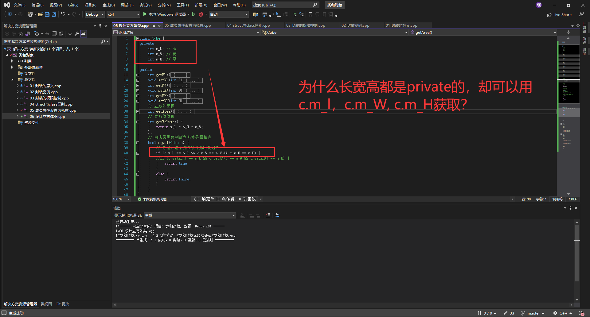

# 自学C++

自学视频地址：

[黑马程序员匠心之作|C++教程从0到1入门编程,学习编程不再难](https://www.bilibili.com/video/BV1et411b73Z?p=10&vd_source=a4e095d68862da71463ae9de87d5356c)

# 内容

- /Helloword 初试C++
- /dataType 数据类型
- /Operator 运算符


# 20220812

## P9 数据类型-sizeof关键字
## P10 数据类型-实型

# 20220813

## P11~P15 数据类型
## P16~P23 运算符


# 20220814

## p24~p41 程序流程结构

# 20220815

## P42数组定义方式~P46 数组冒泡排序

# 20220816

## P47数组-二维数组定义方式~P55 函数-函数的分文件编写

# 20220817

## P56 指针-指针的定义和使用 ~ P59 指针-野指针

# 20220819

## P60 指针-const修饰指针 ~ P63 指针-指针配合数组和函数案例

# 20220820

## P64 结构体-结构体的定义和使用~P71 结构体-结构体案例2

# 20220821

## P72 通讯录管理系统-系统功能介绍及展示 ~ P83 通讯管理系统-清空通讯录

# 20220822

没有看视频，想学一下WebAssembly，测试了一下实现一个斐波那契数列，是javascript快还是C++快，出人意料的是javascript更快，真是奇怪了。

20220902 是编译器的问题.用visual studio编译出来的速度会慢，如果我用 g++ 敲命令去编译，速度会快非常多。

# 20220823

用g++编译斐波那契数列，比用visual studio 编译斐波那契数列，g++编译后的程序运行速度更快。

# 20220824

## P84 01 程序内存模型——内存四区-全局区

  

  C++程序执行时，将内存大方向划分为4个区域：

  - 代码区：存放函数体的二进制代码，由操作系统进行管理
  - 全局区：存放全局变量和静态变量以及常量
  - 栈区：由编译器自动分配和释放，存放函数的参数值，局部变量
  - 堆区：由程序员分配和释放，若程序员不释放，程序结束时由操作系统回收

  内存四区的意义：

  不通区域存放的数据，赋予不通的生命周期，给我们更大的灵活编程。

在程序编译后，生成了exe可执行程序，未执行该程序前分为两个区域：

**代码区**：

存放CPU执行的机器指令。

代码区是**共享**的，共享的目的是对于频繁执行的程序，只需要在内存中存一份代码即可

代码区是**只读**的，使其只读的原因是防止程序意外的修改了它的指令。

**全局区**：

全局变量和静态变量存放在此。

全局区还包含了常量区，字符串常量和其他常量也存放在此。

**该区域的数据在程序结束后由操作系统释放。**


# 20220902

## P85 程序的内存模型-内存四区-全局区

  

全局区中存放：全局变量、全局常量、字符串常量、静态变量

## P86 程序的内存模型-内存四区-栈区

  **栈区：**

  由编译器自动分配释放，存放形参，局部变量等。

  **注意事项：不要返回局部变量的地址，栈区开辟的数据由编译器自动释放。**

## P87 程序的内存模型-内存四区-堆区

**堆区：**
      
由程序员分配释放，若程序员不释放，程序结束时由操作系统回收
      
在C++中主要利用new在堆区开辟内存

  

# 20220903

## P88 程序的内存模型-new运算符

C++中利用操作符在堆区开辟数据

堆区开辟的数据，由程序员手动开辟，手动释放，释放利用操作符 delete

语法: new 数据类型

利用new创建的数据，会返回该数据对应的类型的**指针**.

## P89 C++中的引用-引用的基本语法

引用的基本作用

**作用：**给变量起别名（这个别名和原名都是操作同一个内存）
**语法：**`数据类型 &别名 = 原名`

## P90 引用的注意事项

引用必须初始化
引用在初始化后，不可以改变

## P91 C++中的引用-引用做函数形参

**作用：**函数传参时，可以利用引用的技术让形参修饰实参
**优点：**可以简化指针修改实参

# 20220904

## P92 C++中的引用-引用做函数的返回值

作用：引用是可以作为函数的返回值存在的

注意：**不要返回局部变量引用**

用法：函数调用作为左值


## P93 C++中的引用-引用的本质

本质：**引用的本质在C++内部实现是一个指针常量**
```c++
// 指针常量,指针指向不可以修改，值可以修改
int a = 10;
int* const p = &a;
```

```c++
// 常量指针，指针指向可以修改，值不可以修改
int a = 10;
int const* p = &a;
```

结论：C++推荐引用技术，引用本质是指针常量，但是所有的指针操作编译器都帮我们做了。

## P94 C++中的引用-常量引用

**作用：**常量引用主要用来修饰形参，防止误操作

在函数形参列表中，可以加const修饰形参列表，防止形参改变实参

## P95 函数高级-函数的默认参数

### 函数默认参数

在C++中，函数的形参是可以有默认值的。
语法: `返回值类型 函数名 (参数 = 默认值) {}`

## P96 函数高级-函数的占位参数

C++中函数的形参列表可以有占位参数，用来做占位，调用函数必须填补该位置

语法： 返回值类型 函数名 (函数类型) {}

在现阶段函数的占位参数存在意义不大，但是后面的课程中会用到该技术。

## P97 函数高级-函数重载（重要！）

作用：函数名可以相同，提高复用性

函数重载满足条件：
- 同一作用域下
- 函数名相同
- 函数参数类型不同，或者个数不同 或者顺序不同

**注意：**函数的返回值不可以作为函数重载的条件

## P98 函数高级-函数重载-注意事项

- 引用作为重载条件
- 函数重载碰到默认参数

# 20220905

## P99 类和对象-封装-属性和行为作为整体

C++面向对象的三大特征：封装、继承、多态

C++认为万事万物皆为对象，对象上有其属性和行为。

例如：
人可以作为对象，属性有姓名、年龄、身高、体重...，行为有走、跑、跳、吃饭、唱歌...
车也可以作为对象，属性有轮胎、方向盘、车灯...行为有载人、放音乐、放空调...
具有相同性质的对象，我们可以抽象为类，人属于人类，车属于车类

### 封装

封装是C++面向对象三大特征之一

封装的意义：
- 将属性和行为作为一个整体，表现生活中的事物
- 将属性和行为加以权限控制
**封装意义一：**
在设计类的时候，属性和行为写在一起，表现事物

**语法：**
class 类名 { 访问权限： 属性/行为 };

## P100 类和对象-封装-设计学生类

# 20220906

## P101 类和对象-封装-访问权限

类设计时，可以把属性和行为放在不同的权限下，加以控制

访问权限有三种：

- public 公共权限 类内可以访问，类外可以访问，子类可以访问
- protected 保护权限 类内可以访问，类外不可以访问，子类可以访问
- private 私有权限 类内可以访问，类外不可以访问，子类不可以访问

## P102 struct和class的区别

在C++中struct和class唯一的区别在于 默认的访问权限不同

区别：

- struct默认权限为公共
- class 默认权限为私有

## P103 将成员属性设置为私有

优点1：将所有成员属性设置为私有，可以自己控制读写权限
优点2：对于写权限，我们可以检测数据的有效性。

# 20220907

## P104 类和对象-封装-设计案例1-立方体类

遇到一个有趣的现象：类函数可以访问同类对象的私有变量。



https://www.jianshu.com/p/aae91daa65ab

# 20220908

## P105 类和对象-封装-设计案例2-点和圆的关系

# 20220909

## P106 类和对象-对象特性-构造函数

### 构造函数和析构函数

**对象初始化和清理**也是两个非常重要的安全问题。

一个对象或者变量没有初始状态，对其使用后果是未知。同样的使用一个对象或变量，没有及时清理，也会造成一定的安全问题。

C++利用了**构造函数**和**析构函数**解决上述问题，这两个函数会被编译器自动调用，完成对象初始化和清理工作。对象初始化和清理工作是编译器强制要我们做的事情，因此**如果我们不提供构造和析构，编译器会提供不构造函数和析构函数的空实现**。

- 构造函数：主要作用于创建对象时为对象的成员属性赋值，构造函数由编译器自动调用，无需手动调用
- 析构函数：主要作用于再对象销毁前系统自动调用，执行一些清理工作

**构造函数语法**： `类名(){}`

1、构造函数，没有返回值，也不写void

2、函数名称和类型相同

3、构造函数可以有参数，因此可以发生重载

4、程序在调用对象时会自动调用构造函数，无需手动调用，而且只会调用一次。

**析构函数语法**：`~类名(){}`

1、构造函数，没有返回值，也不写void

2、函数名称和类型相同，在名称前面加上~

3、构造函数**没有有参数**，因此不可以发生重载

4、程序在调用对象时会自动调用析构函数，无需手动调用，而且只会调用一次。

## P107 类和对象-对象特性-函数的分类以及调用

两种分类方式：

按参数分为：有参构造和无参构造

按类型分为：普通构造和拷贝构造

三种调用方式：

括号法

显示法

隐式转换法

# 20220911

## P108 类和对象-对象特性-拷贝构造函数调用时机

C++中拷贝构造函数调用实际通常有三种情况

- 使用一个已经创建王弼的对象来初始化一个新对象
- 值传递的方式给函数参数传值
- 以值方式返回局部对象

## 109 类和对象-对象特性-构造函数的调用规则

默认情况下，C++编译器至少给一个类添加3个函数

1、默认构造函数（无参，函数体为空）
2、默认析构函数（午餐，函数体为空）
3、默认拷贝构造函数，对属性值进行拷贝

构造函数调用规则如下：

- 如果用户定义有参构造函数，C++不再提供无参构造，淡水会提供默认拷贝构造
- 如果用户定义拷贝构造函数，C++不会再提供其它构造函数

# P110 类和对象-对象特性-深拷贝和浅拷贝

深浅拷贝是面试的经典问题，也是常见的一个坑

浅拷贝：简单的赋值拷贝操作

浅拷贝带来的问题是，堆区的内存重复释放
如果属性有在堆区开辟的，一定要自己提供拷贝构造函数，防止浅拷贝带来的问题。

深拷贝：在堆区重新申请空间，进行拷贝操作

## P111 类和对象-对象特性-初始化列表

C++提供了初始化列表语法，用来初始化属性。

语法：`构造函数() 属性1(值1), 属性2 (值2)... {}`

# 20220912

## P112 类和对象-对象特性-类对象作为类成员

C++中类的成员可以是另一个类的对象，我们称作该成员为 **对象成员**

## P113 类和对象-静态成员

静态成员就是在成员变量和成员函数前加上关键字static，称为静态成员。

静态成员分为：

- 静态成员变量
	- 所有对象共享同一份数据
	- 在编译阶段分配内存
	- 类内声明，类外初始化
	
- 静态成员函数
	- 所有对象共享一个函数
	- 静态成员函数只能访问静态成员变量

## P114 类和对象-对象特性-成员变量和成员函数分开存储

在C++中，类内的成员变量和成员函数分开存储

只有非静态成员变量才属于类的对象上。

# P115 类和对象-对象特性-this指针的用途

每一个非静态成员函数只会诞生一份**函数实例**，也就是说多个同类型的对象会共用一块代码

那么问题是：这一块代码是是如何区分那个对象调用自己呢？

C++通过提供特殊的对象指针，this指针，解决上述问题。**this指针指向被调用的成员函数所属的对象。**

this指针是隐含每一个非静态成员函数内的一种指针。

this指针不需要定义，直接使用即可。

this指针的用途：

- 当形参和成员变量同名时，可用this指针区分
- 在类的静态成员函数中返回对象本身，可使用 `return *this`

静态成员没有this,因为静态成员不属于某个实例对象。

# 20220913

## P116 类和对象-对象特性-空指针访问成员函数

C++中空指针也是可以调用成员函数的，但是也要注意有没有使用this指针。

如果用到this指针，需要加以判断代码的健壮性。

## P117 类和对象-对象特性-const修饰成员函数

### 常函数

- 成员函数后加const我们称这个函数为常函数
- 常函数内不可以修改成员属性
- 成员属性声明时加关键字mutable后，再常函数中依然可以修改


### 常对象

- 声明对象前加const称该对象为常对象
- 常对象只能调用常函数

