看视频学C++也有一段时间了，中间断断续续的，其实连入门也没做到。

看的视频来自[B站](https://www.bilibili.com/video/BV1et411b73Z?p=158&spm_id_from=pageDriver&vd_source=a4e095d68862da71463ae9de87d5356c)

看视频看的也是断断续续的，好多之前视频中讲过的标准库的函数之类的后面都忘了，以至于看视频的时候总是想不起来，总不能把以前的视频再看一遍吧。

所以，标准库的文档还是很重要的。

# 方法1(建议和方法2一起使用)
标准库的文档可以去官网找（标准库中没有写明继承关系）

查找方法如下：

1、搜索微软官网

https://learn.microsoft.com/zh-cn/cpp/standard-library/basic-ifstream-class?view=msvc-170

2、进入文档

在菜单栏中，选择`所有 Microsoft -->  开发人员与IT --> 文档`

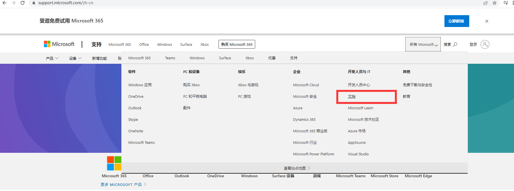

3、在产品目录中选择C++

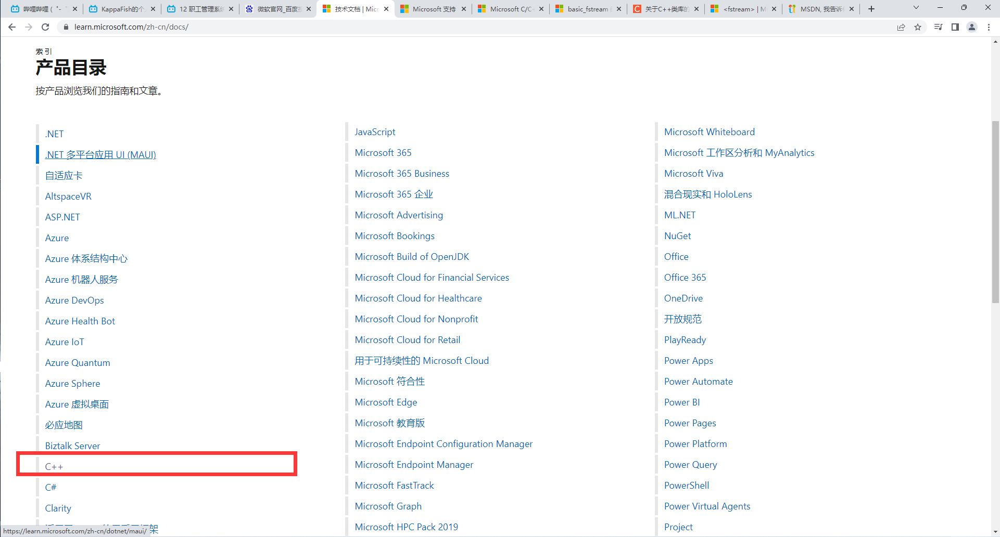

4、在语言文档中选择 标准库 C++标准库参考（按标题）

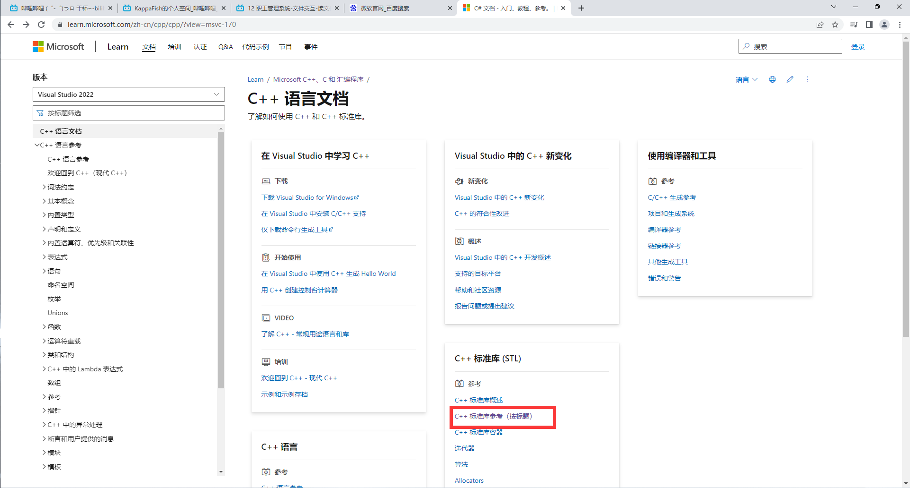

5、搜索自己用到的标准库

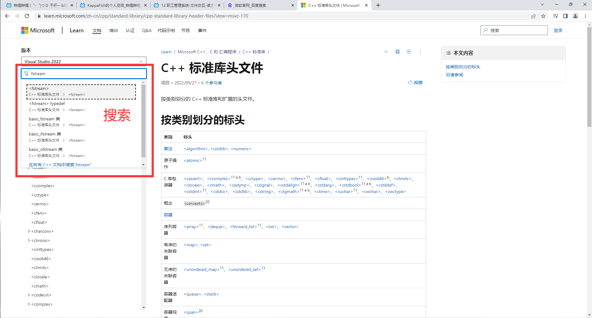

6、选择自己用到的类

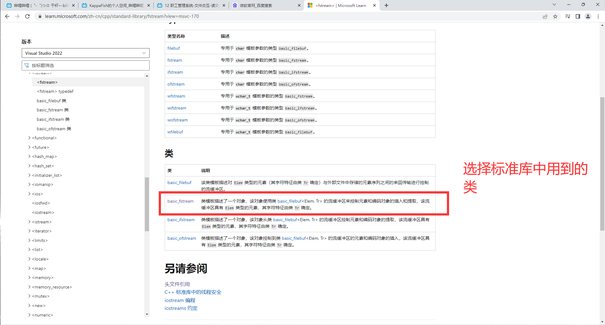

7、可以看到这个类相关的信息

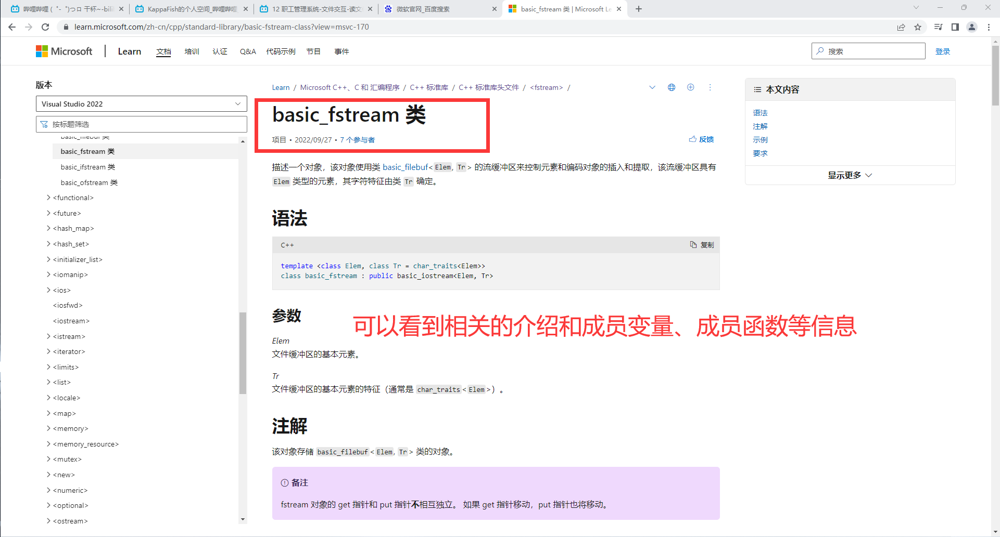

8、但是没有显示继承过来的函数

比如，ifstream类中，其实还有 getline等函数，但是这个文档中并没有显示。

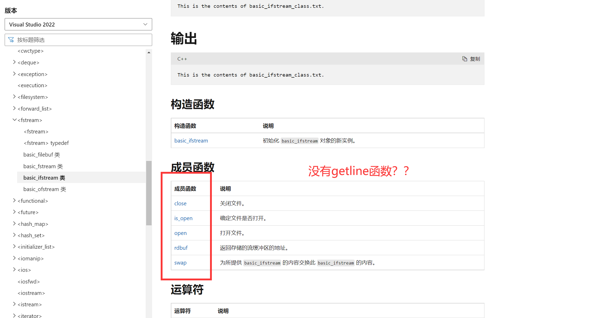

但是我们知道了这个basic_ifstream类是一个基于IO流的类

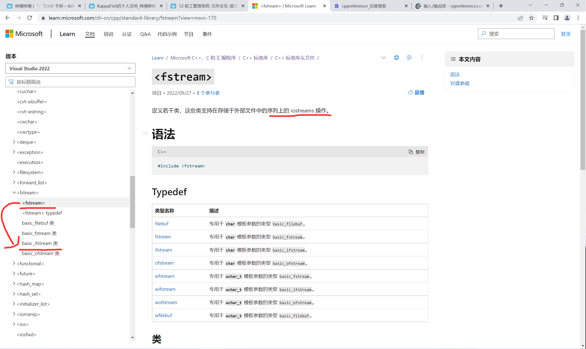

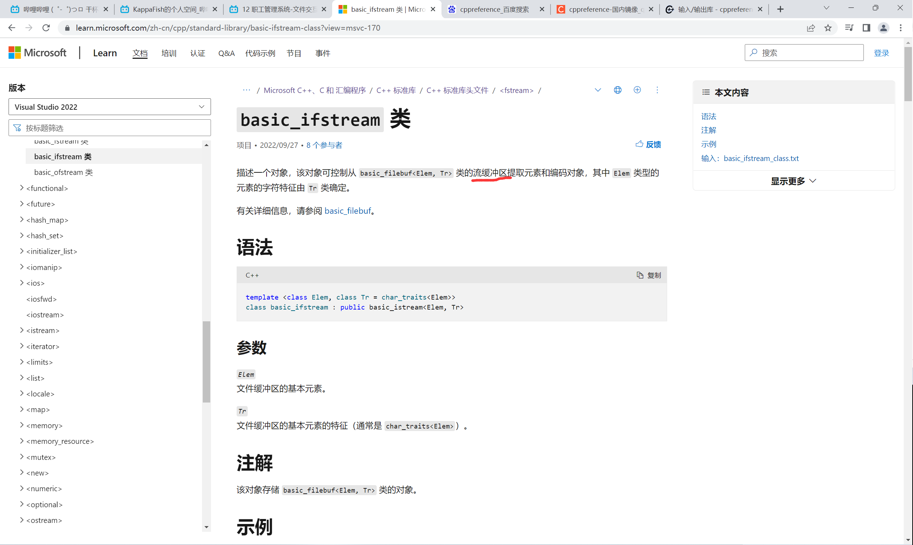

于是我们就可以用方法二去查更详细的内容了

# 方法2：

可以访问[cppreference](https://zh.cppreference.com/w/%E9%A6%96%E9%A1%B5)

注意：**不要使用这个网站的搜索功能**。可能是因为墙的关系，这个网站的搜索功能不可用。

同样是想要查一下ifstream的信息，我们进入网站后选择 **输入/输出库 --> 基于流的 I/O**

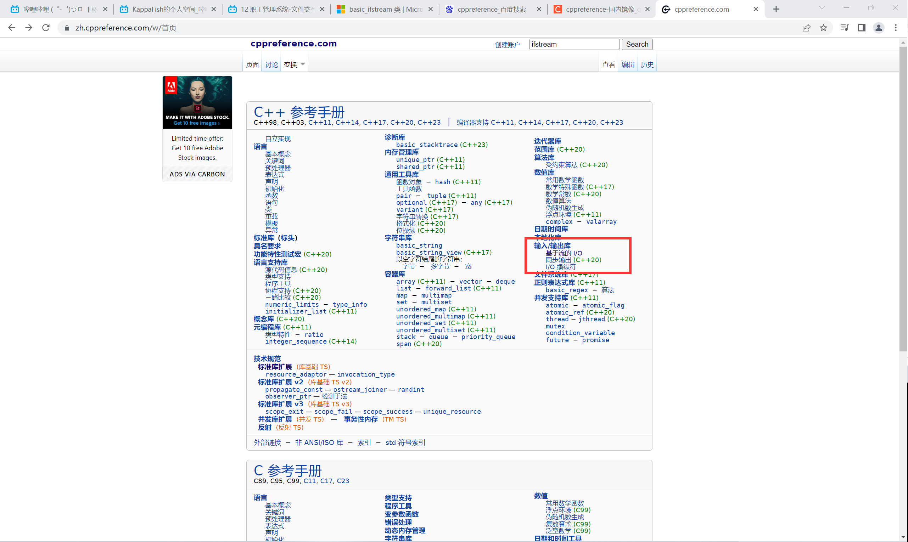

然后选择 *basic_ifstream*

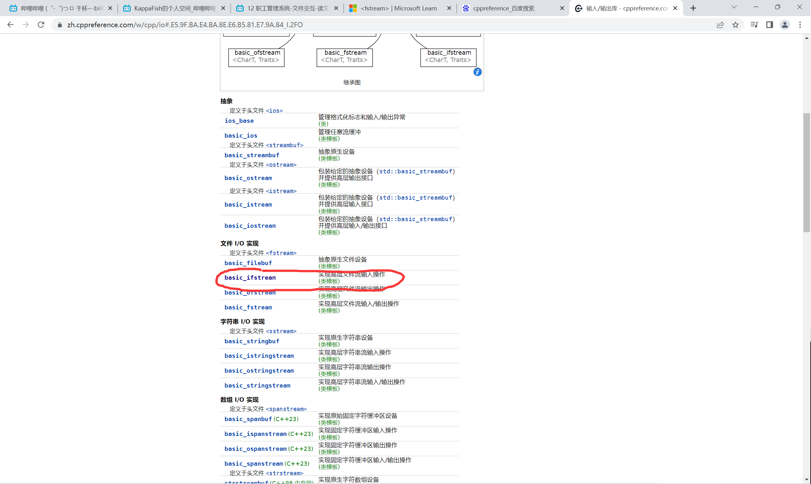

除了自身的成员函数外，还能查到继承的成员函数信息

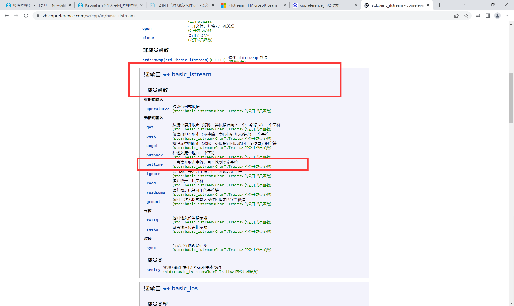

查看成员函数详细信息

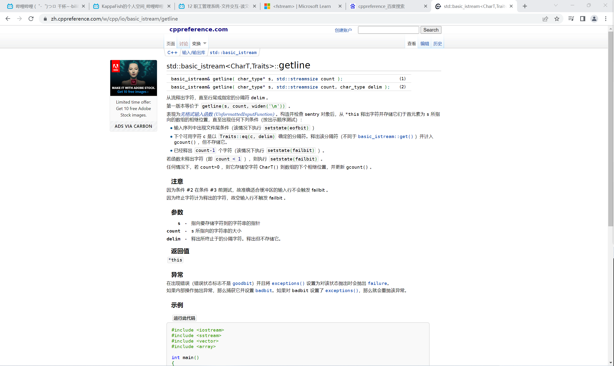