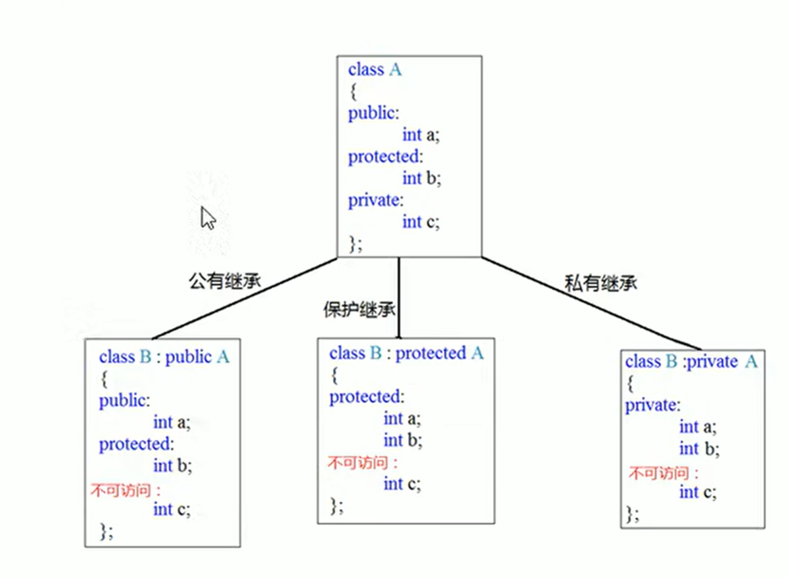

# 20220916

## P127 类和对象-继承-基本语法

**继承是面向对象的三大特性之一**

有些类与类之间的存在特殊的关系，例如下图中：


我们发现，定义这些类时，下级别的成员除了拥有上一级的共性，还有自己的特性。

这个时候我们就可以利用继承的技术，减少重复代码。

**总结：**

继承的好处： 可以减少重复的代码

```c++
class A: public B;
```
A类称为子类或派生类
B类称为父类或基类

派生类中的成员，包含两大部分：
一类是从基类继承过来的，一类是自己增加的成员。
从基类继承过来的表现其功效，而新增的成员体现了个性。

# 20220917

## P128 类和对象-继承-继承方式

继承的语法： class 子类： 继承方式 父类

**继承的方式一共有三种：**

- 公共继承
- 保护继承
- 私有继承



**公共继承**：
能继承父类的public、protected 权限的成员.不能继承父类的private成员

且父类中的public属性到了子类中依然是public。父类中的protected属性到了子类中依然是protected属性

**保护继承**

能继承父类的public、protected 权限的成员.不能继承父类的private成员

且父类中的public和protected成员到了子类中全都变成protected成员

**私有继承**

能继承父类的public、protected 权限的成员.不能继承父类的private成员

且父类中的public和protected成员到了子类中全都变成private成员

# 20220920

## P129 类和对象-继承-继承中的对象模型

从父类继承过来的的成员，那些属于子类对象中？

父类中所有非静态成员属性都会被继承下去（包括private成员）
父类中私有属性，被编译器隐藏了，因此访问不到，但是确实被继承下去了。