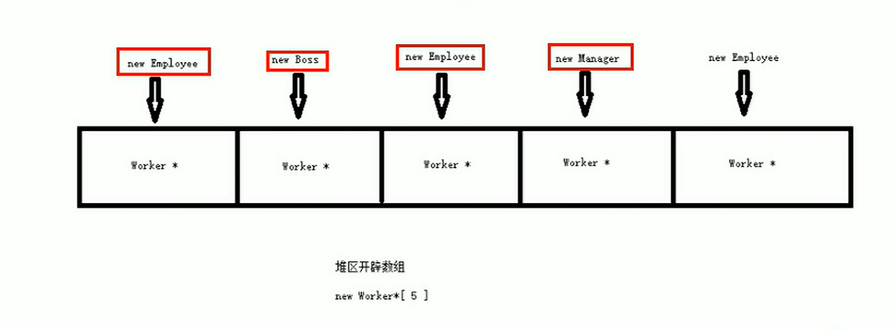

# 20220929

## P147 职工管理系统-需求分析以及案例展示

### 职工管理系统需求分析

职工管理系统可以用来管理公司内所有员工的信息
本教程主要利用C++来实现一个基于多态的职工管理系统。

公司中职工分为三类：普通员工、经理、老板，显示信息时，需要显示职工编号、职工姓名、职工岗位、以及职责。

普通员工职责：完成经理交给的任务
经理职责：完成老板交给的任务，并下发给员工
老板职责：管理公司所有事务

管理系统中需要实现的功能如下：
- 退出管理程序：退出当前管理系统
- 增加职工信息：实现批量添加职工功能，将信息录入到文件中，职工信息为:职工编号、姓名、部门编号
- 显示职工信息：显示公司内部所有职工的信息
- 删除离职职工：按照编号删除指定的职工
- 修改职工信息：按照职工的编号或者职工的姓名进行查找相关人员信息
- 按照编号查找排序：按照职工编号，进行排序，排序规则由用户指定
- 清空所有文档：清空文件中记录的所有职工信息（清空前需要再次确认，防止误删）

# 20221010

## P148 职工管理系统-创建项目

## P149 职工管理系统-创建职工管理类

管理类负责的内容如下：
- 与用于的沟通菜单界面
- 对职工增删改查的操作
- 与文件的读写交互

## P150 职工管理系统-菜单功能实现

## P151 职工管理系统-退出系统功能实现

# 20221011

## P152 职工管理系统-职工抽象类和普通员工类

## P153 职工管理系统-经理类和老板类实现

# 20221014

## P154 08 职工管理系统-添加职工功能实现

### 功能分析

分析：
用户批量创建时，可能会创建不同种类的职工

如果要将所有不同种类的员工都放入一个数组中，可以将所有员工的指针维护到一个数组里

如果想再程序中维护这个不定长度的数组，可以将数组创建到堆区，并利用`Worker **` 的指针维护。

# 20221021

## P155 09 职工管理系统-文件交互-写文件

功能描述：对文件进行读写
再上一个添加功能中，我们只是将所有的数据添加道了内存中，一旦程序结束就无法保存了。

因此文件管理类中需要一个与文件进行交互的功能，对文件进行读写操作。

## P156 10 职工管理系统-文件交互-读文件1-文件未创建

功能描述中：将文件中的内容读取到程序中

虽然我们实现了添加职工后保存到文件的操作，但是每次开始运行程序，并没有将文件读取到文件中

而我们的程序功能中还有清空文件的需求

因此构造函数初始化数据的情况分为3种。

1、第一次使用，文件未创建
2、文件存在，但是数据被用户清空
3、文件存在，并且保存职工的所有数据

## P157 11 职工管理系统-文件交互-读文件2-文件为空